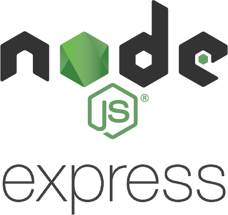

# HIGH SPEED COMMUTE

High Speed Commute is an action-packed race to work against your boss. Get there first so he doesn't know you're late!

<!-- ## In Action

<a href=#>Heroku Deployment Link</a> -->

# User Stories

## Implemented:

- As a user, I want to use my arrow keys to control my car and move through the street grid.
- As a user, I want the Boss to pick the fastest route to work and move there at a steady pace so I can race him.
- As a user, I want to be given a promotion if I am on time or be fired if I am late.
- As a user, I want to also lose if I crash into my Boss on the way to work.
- As a user, I want to be able to reset the game and play again.
- As a user, I want the UI to have the look and feel of a retro Gameboy or arcade game.
- As a user, I want to be able to design, save, and play my own levels.

## Coming Soon:
- As a user, I want to give myself a username.
- As a user, I want a record of my win or loss to be persisted after the game is over.
- As a user, I want to be able to pick the color of my car.
- As a user, I want to be able to set difficulty levels for the Boss.
- As a user, I want the added challenge of stoplights along the route.
- As a user, I want the added challenge of school zones along the route.
- As a user, I want the added challenge of road closures along the route.
- As a user, I want the added challenge of unexpected car crashes/trees falling along the route.
- As a user, I want the game to track my time and persist my score along with my win/loss.
- As a user, I want to be able to see my stats from past games.
- As a user, I want to be able to see how my stats compare to other players.
- As a user, I want more than one level to play.

# Stack

<table>
  <tr>
  </tr>
  <tr>
    <td align="center">Front-end</td>
    <td align="center">Back-end</td>
  </tr>
  <tr>
    <!-- <td align="center"></td> -->
    <td align="center"></td>
    <td align="center"></td>
  </tr>
  <tr>
    <!-- <td align="center"></td> -->
    <td align="center"></td>
    <td align="center"></td>
  </tr>
</table>

## Front-End
High Speed Commute was built with Javascript and vanilla React (create-react-app) on the front end. For this application I wanted to keep the technology simple to focus on the logic and data structure of the game.

## Back-End 
High Speed Commute uses Node.js and Express to create a server that interacts with a PostgreSQL database and provides all user, game, and level information to the React app.

## Deployment
[Coming eventually]

<!-- # Get started

How to run the app on localhost:

  - In first terminal window: 
    - git clone https://github.com/Collin-Snyder/high-speed-commute.git
    - cd
  -  -->

## Challenges
- In building High Speed Commute, I wanted to learn more about pathfinding algorithms used to move non-player characters, since the Boss character has to both find a working path to a given target and also navigate a maze in the process. Initially I attempted to implement

## Learnings
- ...

# Contributors

[Collin Snyder](https://github.com/Collin-Snyder)