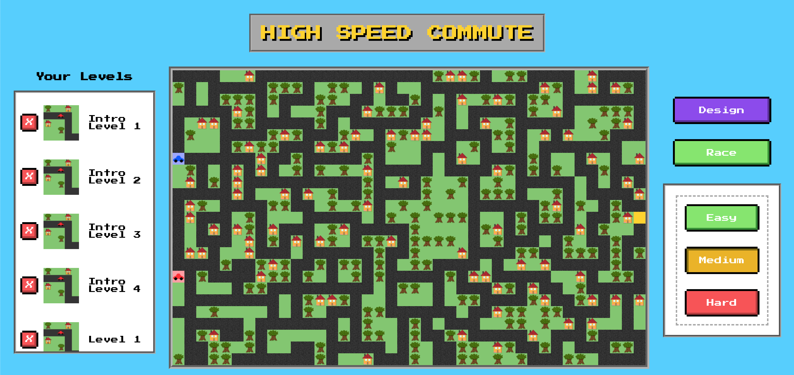
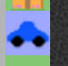
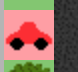
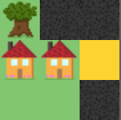
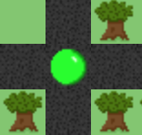
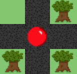
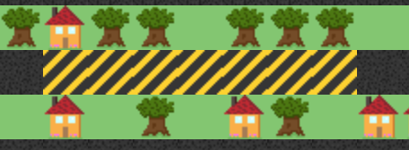
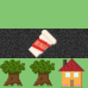

# HIGH SPEED COMMUTE

High Speed Commute is an action-packed race to work against your boss. Get there first so she doesn't know you're late!

<!-- ## In Action

<a href=#>Heroku Deployment Link</a> -->

## The Game

Uh oh! You woke up late again (you _knew_ you shouldn't have hit snooze that last time). Fortunately for you, your boss comes in to work later than you - but boy will she be mad if she arrives and you aren't there yet.

You grab a breakfast bar, brush your teeth while throwing on the last clean thing in your closet, and hurry out the door - the race to work begins! Now you've got to navigate your neighborhood's maze of streets to get there first.

Your car:

Your boss's car:

The office:

### A couple of pointers:

- Watch out for changing stoplights - you can't run a red light in this town.

            

- Avoid school zones - you have no choice but to proceed through them slowly for safety.

  

- If you can, grab some coffee on the way! The caffeine boost will turbocharge your driving.

  

## The App

### Gameplay

Select from Easy, Medium, and Hard mode.

 

Start the race! The boss's speed depends on the difficulty mode.

 

Game outcomes: win or loss.

[gif 5 - loss]

Pro tip - don't hit your boss.

[gif 6 - collision]

### Obstacles

Stoplights cycle on individual timers. You can run a yellow light, but you'll have to wait if you get caught at a red.

[gif 7 - stoplight demo]

Schoolzones slow down both you and your boss - safety first!

[gif 8 - schoolzone demo]

Grab a coffee if you have time - caffeination increases your speed for a short time!

[gif 9 - coffee demo]

### Design Mode

## Stack

<table>
  <tr>
  </tr>
  <tr>
    <td align="center">Front-end</td>
    <td align="center">Back-end</td>
  </tr>
  <tr>
    <!-- <td align="center"></td> -->
    <td align="center"></td>
    <td align="center"></td>
  </tr>
  <tr>
    <!-- <td align="center"></td> -->
    <td align="center"></td>
    <td align="center"></td>
  </tr>
</table>

### Front-End
High Speed Commute was built with Javascript and vanilla React (create-react-app) on the front end. For this application I wanted to keep the technology simple to focus on the logic and data structure of the game.

Custom retro button styling and behavior was created using CSS while icons and pixel artwork was created in Adobe Illustrator.

### Back-End 
High Speed Commute uses Node.js and Express to create a server that interacts with a PostgreSQL database and provides all user, game, and level information to the React app.

### Deployment
[Coming eventually]

<!-- # Get started

How to run the app on localhost:

  - In first terminal window: 
    - git clone https://github.com/Collin-Snyder/high-speed-commute.git
    - cd
  -  -->

### Challenges
- In building High Speed Commute, I wanted to learn more about pathfinding algorithms used to move non-player characters, since the Boss character has to both find a working path to a given target and also navigate a maze in the process. Initially I attempted to implement

### Learnings
- ...

### Contributors

[Collin Snyder](https://github.com/Collin-Snyder)